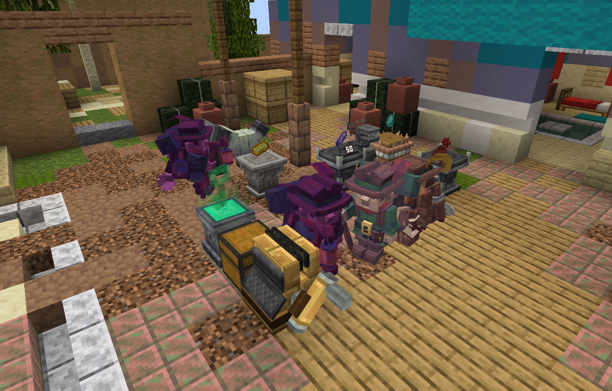

# EurekaBusiness Documentation

Welcome to the official **EurekaBusiness** documentation. EurekaBusiness is a multiplayer-ready shop management and retail simulation mod for Minecraft 1.21.1 / NeoForge.

This documentation serves players, shop owners, modpack creators, and addon developers with comprehensive guides, item and block references, configuration details, and development APIs.

---

## Who is this documentation for?

This site is structured to provide clear and accurate information for different users:

* **Players & Shopkeepers**: Learn how to zone shops from scratch, display goods, attract customer NPCs, process transactions, and decorate your store.
* **Modpack Creators**: Inspect configuration options directly under each relevant feature section to customize items, catalog entries, element economics, and balance settings.
* **Addon Developers**: Explore Core and Retail APIs, register custom elements, declare customer variants, and implement custom AI algorithms.

> [!NOTE]
> EurekaBusiness follows a **server-authoritative architecture**. Shop states, pricing evaluations, basket reservations, transactions, and persistent state remain strictly verified by the server. The client handles input and rendering only.

---

## Technical Baseline & Requirements

| Specification | Target Baseline |
| :--- | :--- |
| **Minecraft Version** | Java Edition `1.21.1` |
| **Mod Loader** | NeoForge `21.1.x` (Recommended `21.1.238`+) |
| **Java Toolchain** | Java 21 |
| **Required Dependencies** | `Fzzy Config` (`0.7.6+1.21+neoforge`), `Kotlin for Forge` (`5.4.0`) |
| **Modular Structure** | Core platform foundations and Retail gameplay content |
