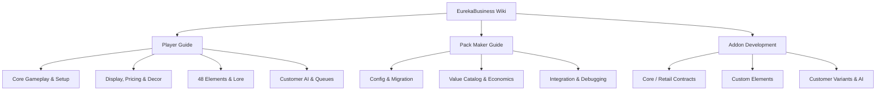

# EurekaBusiness Documentation

Welcome to the official **EurekaBusiness** documentation. GitHub is the primary source repository, published through GitBook.

EurekaBusiness is a cooperative simulation and shop management mod for Minecraft 1.21.1 / NeoForge. This wiki provides comprehensive guides, configuration manuals, and API references for players, modpack creators, and addon developers.

---

## Quick Navigation

### 1. Player Guide
- [Core Gameplay & Shop Setup](players/Gameplay-Guide.md)
- [Display Pedestals, Pricing & Settlement](players/Shop-Management.md)
- [Shop Decorations & Area Buffs](players/Decoration-Guide.md)
- [48 Elements & Item Lore System](players/Elements-System.md)
- [Customer Behaviors, Variants & Cashier Queuing](players/Customer-Behaviors.md)

### 2. Modpack Creator Guide
- [Configuration & Schema Migration Guide](pack-makers/Configuration-Guide.md)
- [Item Value Catalog & Element Economics](pack-makers/Catalog-and-Economics.md)
- [Modpack Integration & Developer Tools](pack-makers/Pack-Integration.md)

### 3. Addon Developer Guide
- [Module Architecture & Boundaries](modules/Architecture-Contracts.md)
- [Core Module API Overview](modules/Core-Module.md)
- [Retail Module Extension Points](modules/Retail-Module.md)
- [Restaurant Module Boundaries](modules/Restaurant-Module.md)
- [Addon API Overview](addon-developers/Addon-API-Overview.md)
- [Custom Elements & Registry Contracts](addon-developers/Custom-Elements.md)
- [Customer Variants & AI Algorithms](addon-developers/Customer-Variants-and-AI.md)

---

## Mod Version & Baseline

| Attribute | Specification |
| --- | --- |
| **Game Version** | Minecraft Java Edition `1.21.1` |
| **Mod Loader** | NeoForge `21.1.x` (`21.1.238`+ recommended) |
| **Java Version** | Java 21 |
| **Required Dependencies** | `Fzzy Config` (`0.7.6+1.21+neoforge`), `Kotlin for Forge` (`5.4.0`) |
| **Audiences** | Players, Modpack Creators, Addon Developers |
| **Network Model** | Server authoritative. The client handles only rendering and user interactions. |
