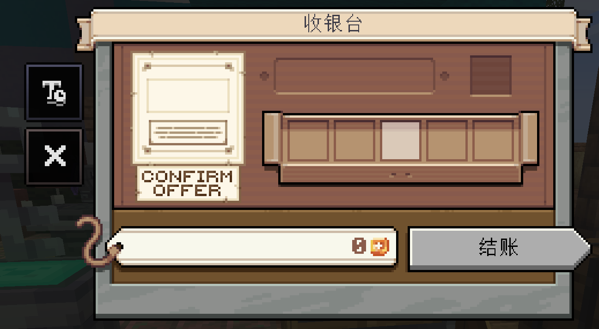
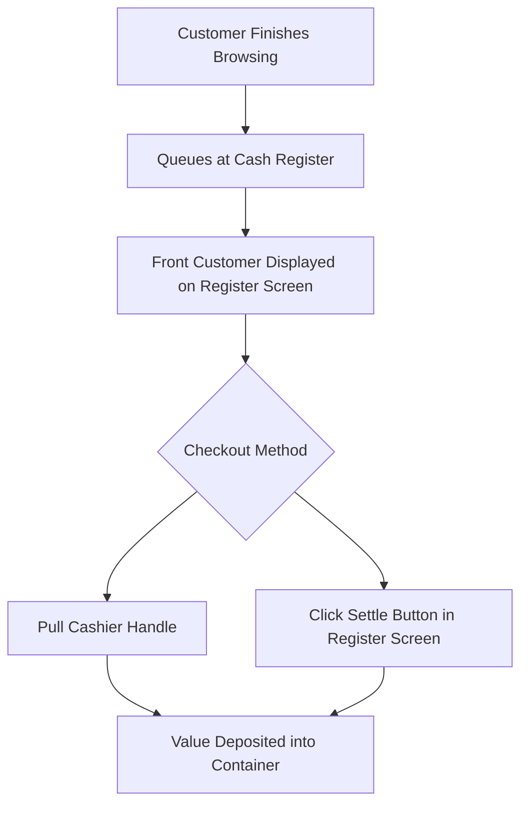
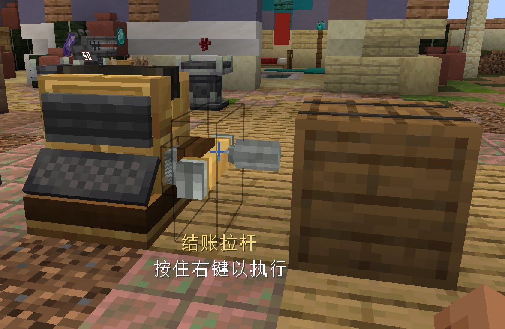

# Cash Register & Checkout

This section details the physical checkout counters, handles, and transaction settlement mechanics.

---

## Cash Register

* **Block Registry Name**: `eurekabusinesscore:cash_register`
* **Block Entity**: `CashRegisterBlockEntity`
* **Description**: Central checkout block. Customers queue in front of it to pay, while an installed Value Container accumulates sales profits.

### Structure & UI

1. **Customer Screen**: Displays the front customer's **42x42 portrait**, name, and total basket price.
2. **Container Slot**: Right-click the register to access the management UI and insert a **Value Container**. A valid container is required to open the shop.
3. **Queue Liveness**: Customers form a single-file line. If the front customer is ignored for extended periods, queue liveness policies safely release the shopper.

---

## Cashier Handle

* **Block Registry Name**: `eurekabusinesscore:cashier_handle`
* **Block Entity**: `CashRegisterHandleBlockEntity`
* **Description**: Mechanical pull handle placed beside the cash register for physical checkout interactions.

### Placement & Operation

* **Placement**: Must be placed directly adjacent to the right side of the Cash Register with matching facing orientation.
* **Pulling Interaction**: Right-clicking the handle triggers a mechanical pull animation and sound effect, completing the atomic checkout transaction for the front customer.
* **Transaction Feedback**:
  * Total value is credited to the register's Value Container;
  * Customer plays success feedback and departs toward an exit;
  * Transaction records are committed server-side.

> [!TIP]
> Pulling the Cashier Handle and clicking the settle button in the register GUI invoke the same server-side atomic settlement transaction.
