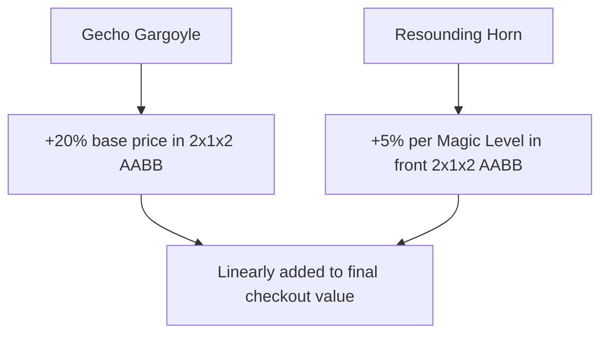

# Shop Decorations

This section details the decorative blocks that enhance shop aesthetics and grant spatial buffs to displayed items.

---

## Decoration Overview

Placing decorative blocks inside shop bounds automatically buffs covered pedestals:

---

## Gecho Gargoyle

* **Block Registry Name**: `eurekabusinessretail:gecho_gargoyle`
* **Item Registry Name**: `eurekabusinessretail:gecho_gargoyle`
* **Buff Effect**: Increases the base selling price of goods on all pedestals within its centered $2 \times 1 \times 2$ bounding box by **+20%**.


Position the gargoyle in the center of your general sales racks to maximize pedestal coverage.


---

## Resounding Horn

* **Block Registry Name**: `eurekabusinessretail:resounding_horn`
* **Item Registry Name**: `eurekabusinessretail:resounding_horn`
* **Buff Effect**: Boosts items with the **Magic Element (`praecantatio`)** by **+5% per element level** across its forward $2 \times 1 \times 2$ zone.


Align the horn directly facing high-tier enchanted books or alchemy displays to create premium magic display cases.


---

## Stacking & Persistence

* **Linear Stacking**: Buffs from multiple unique decoration types stack linearly on covered pedestals.
* **Persistent Recovery**: Decoration positions and spatial bounds restore automatically across world reloads and server restarts.
