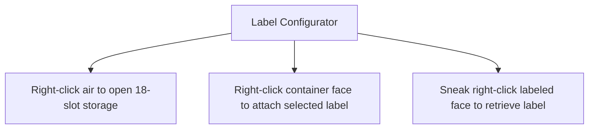

# Container Labels & Configurator

This section covers the container label system, attachment mechanics, and specialized return/tip containers.

---

## Label Configurator

* **Item Registry Name**: `eurekabusinesscore:label_configurator`
* **Max Stack Size**: 1
* **Description**: Multi-function tool for storing, attaching, and detaching container labels with an integrated 18-slot pouch.

### Controls & Actions

1. **Integrated Storage**: Right-click the air to access an 18-slot inventory dedicated to label items.
2. **Surface Attachment**: Right-click any container face (chests, barrels, modded inventories) to apply the active label.
3. **Retrieval**: Sneak right-click a labeled container surface with the configurator to retrieve the label into your storage pouch.

---

## Blank Label

* **Item Registry Name**: `eurekabusinesscore:blank_label`
* **Max Stack Size**: 64
* **Description**: Neutral cosmetic label for container marking and crafting base for specialized functional labels.

---

## Return Label

* **Item Registry Name**: `eurekabusinessretail:return_label`
* **Max Stack Size**: 64
* **Description**: Designates containers as **Unpaid Goods Return Bins**.

### Customer Return Journey

When customers abandon their shopping journey (due to store closure, insufficient budget, or path aborts) while holding unpaid items:
- The customer navigates toward the nearest container with an active **Return Label**;
- Depositing all reserved goods into the container before exiting;
- Preventing item loss and keeping shop inventory secure.

---

## Tip Label

* **Item Registry Name**: `eurekabusinessretail:tip_label`
* **Max Stack Size**: 64
* **Description**: Designates containers as **Customer Tip Jars**, allowing delighted customers to leave bonus compensation upon departure.

> [!TIP]
> Labels can be attached to vanilla chests, barrels, and most modded storage blocks.
