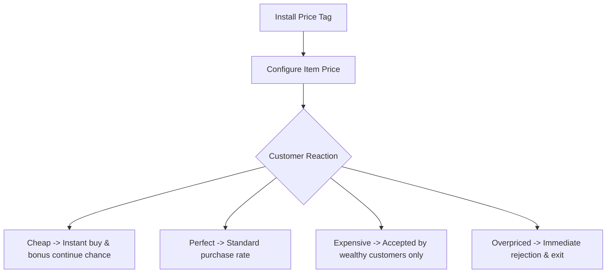

# Display Pedestals & Price Tags

This section explains the pedestal variants, pricing modules, and display systems.

---

## Display Pedestals


* **Block Registry Names**:
  * `eurekabusinessretail:nomad_pedestal` (Nomad Pedestal)
  * `eurekabusinessretail:deepslate_pedestal` (Deepslate Pedestal)
  * `eurekabusinessretail:stone_pedestal` (Stone Pedestal)
* **Block Entity**: `DisplayPedestalBlockEntity`
* **Description**: Primary display block that holds items and accommodates 8 augment slots.

### Key Features

* **Dynamic Capacity**: Follows the item's native max stack size (e.g., 16 for Ender Pearls, 64 for Ores).
* **Holographic Rendering**: Displays goods rotating smoothly above the pedestal with clear visibility.
* **Side Plugin Panels**: Each of the 4 horizontal sides has a localized hit zone. Interacting with the side panel opens the **8-slot Pedestal Plugin UI**.


---

## Price Tag Module

* **Item Registry Name**: `eurekabusinessretail:upgrade/price_tag`
* **Max Stack Size**: 1
* **Description**: Inserted into a pedestal augment slot to publish public prices to customers.

### Pricing & Customer Reactions



1. **World-Space Display**: Shows compact `K/M/B` numbers on a 22.5° angled plate.
2. **Fast Adjustment**:
   - Enter digits directly in the pedestal selling GUI;
   - Use the in-world Value Box to adjust values on the fly.
3. **Lowest Price Priority**:
   - When identical items exist on multiple pedestals with different prices, customers always browse the cheapest pedestal first.

---

## Upgrade Template

* **Item Registry Name**: `eurekabusinessretail:upgrade_template`
* **Max Stack Size**: 1
* **Description**: Base template used to craft pedestal augments and upgrade modules in crafting tables or smithing tables.

---

## Pack Maker Configuration Reference

Item pricing tables are configured via Fzzy Config (`config/eurekabusinessretail.toml` under `eurekabusinessretail:value_catalog`):

```toml
[[catalogEntries]]
itemId = "minecraft:diamond"
cheap = { start = 35, end = 80, stamp = 55 }
perfect = { start = 81, end = 220, stamp = 150 }
expensive = { start = 221, end = 400, stamp = 310 }
overpriced = { start = 401, end = 650, stamp = 525 }

[[catalogEntries.elements]]
elementId = "eurekabusinesscore:element_vitreus"
level = 3
```

> [!NOTE]
> Modpack creators can freely add entries for custom modded items with element properties. Clients automatically synchronize valid server-side catalogs.
