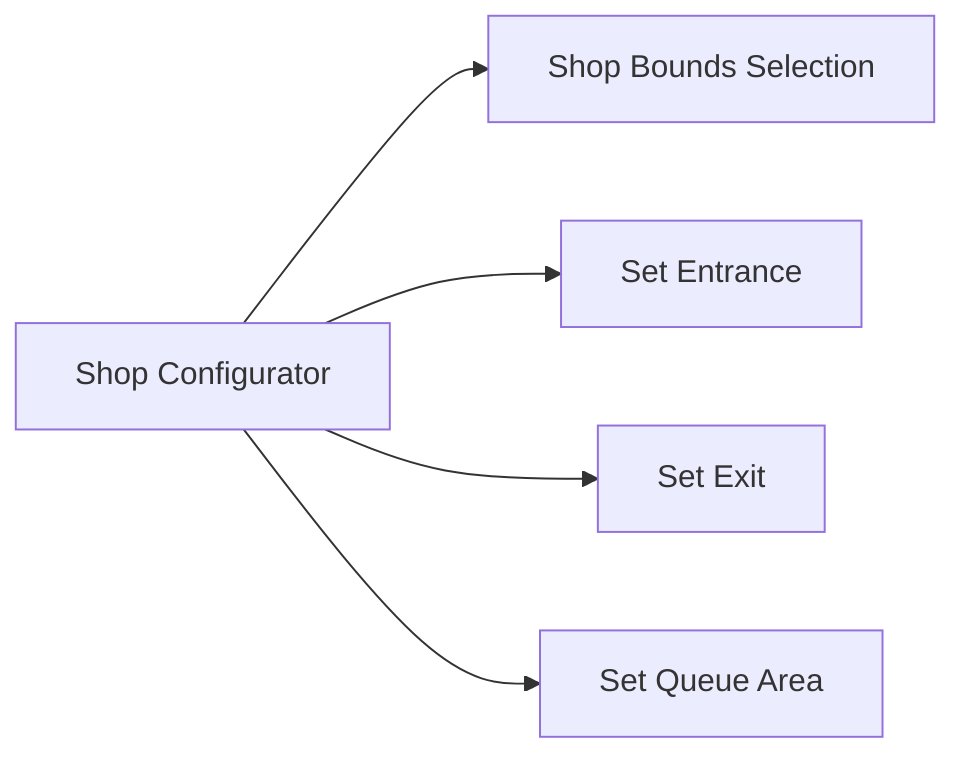

# Shop Management & Keys

This section covers the core items and blocks used for shop spatial zoning, ownership binding, and business status control.

---

## Shop Configurator

* **Item Registry Name**: `eurekabusinesscore:shop_configurator`
* **Max Stack Size**: 1
* **Description**: Tool for zoning shop bounding boxes (AABB), setting customer entrances, exits, and queue areas.

### Usage Instructions

1. **Mode Switching**: Hold the interaction key or right-click the air to open the mode radial menu. The configurator head tint changes color dynamically based on the active mode.
2. **Zoning Shop Bounds**:
   - Switch to `Shop Bounds Selection` mode.
   - Sneak right-click the first corner block, then right-click the opposite diagonal block. A 3D bounding box (AABB) is defined.
3. **Configuring Entrances, Exits, and Queues**:
   - Switch to `Set Entrance` / `Set Exit` mode and right-click floor blocks to mark customer spawn and departure points.
   - Switch to `Set Queue Area` mode and right-click ground blocks in front of cash registers to configure waiting lines.

> [!CAUTION]
> The Shop Configurator locks spatial modifications while the shop is open or while customers remain inside. Retrieve the key from the Key Device to drain existing shoppers before reconfiguring boundaries.

> [!TIP]
> Multiple entrances and exits are fully supported. Customers dynamically calculate congestion weights and path lengths to select optimal doors.

---

## Key Device

* **Block Registry Name**: `eurekabusinesscore:key_device`
* **Block Entity**: `KeyDeviceBlockEntity`
* **Description**: Physical shop switch that displays active store boundaries and holographic keys.

### Block Mechanics

* **Light Pillars & Visual Indicators**:
  - **No Key**: Resting state (Light Level 5).
  - **Key Inserted (Closed)**: Outer light pillar active (Light Level 10), indicator lit.
  - **Open for Business (OPEN)**: Dual coaxial light pillars active (Light Level 15) with a rotating green holographic key projected overhead.
* **Hopper Protection**: The Key Device does not expose item capabilities to hoppers or pipes, ensuring key extraction remains a physical player action.

---

## Shop Key

* **Item Registry Name**: `eurekabusinesscore:shop_key`
* **Max Stack Size**: 1
* **Description**: Holds shop identity, owner credentials, and bound Key Device coordinates.

### Interaction & Binding

* **Initial Binding**: Hold an unbound Shop Key and sneak right-click a placed Key Device inside your shop bounds.
* **Operation**:
  * **Insert Key**: Right-click the Key Device while holding the bound key.
  * **Toggle Open/Close**: Empty-hand sneak right-click the keyed device to toggle business hours.
  * **Retrieve Key**: Empty-hand normal right-click the device to retrieve the key and trigger shop closure.
* **Unbinding**: Place a bound Shop Key into any crafting grid by itself to clear all metadata.

> [!NOTE]
> The key carries a cryptographic credential snapshot. Every operation is re-verified authoritatively on the server.
