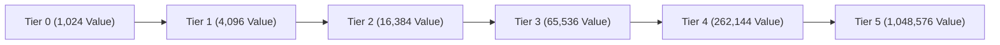

# Value Containers & Profit

This section details the value storage vessels used to collect checkout revenue and their 5-tier upgrade progression.

---

## Value Container

* **Block & Item Registry Name**: `eurekabusinesscore:value_container`
* **Block Entity**: `ValueContainerBlockEntity`
* **Description**: Primary revenue collection container required in cash registers. Can be carried as an item or placed in the world as a block.

---

## 5-Tier Upgrade Progression

Each upgrade quadruples the maximum capacity:

| Tier | Capacity | Upgrade Requirement | Placed Light Level |
| :---: | :---: | :--- | :---: |
| **Tier 0** | `1,024` Value | Default crafting recipe | 0 ~ 1 |
| **Tier 1** | `4,096` Value | Full (1,024) self-crafting in grid | 1 ~ 2 |
| **Tier 2** | `16,384` Value | Full (4,096) self-crafting in grid | 2 ~ 4 |
| **Tier 3** | `65,536` Value | Full (16,384) self-crafting in grid | 4 ~ 5 |
| **Tier 4** | `262,144` Value | Full (65,536) self-crafting in grid | 5 ~ 7 |
| **Tier 5** | `1,048,576` Value | Full (262,144) self-crafting in grid | 8 (Max) |

### Upgrade Rules

1. **Full Capacity Condition**: Only a fully filled container can be placed into a crafting grid by itself to trigger the upgrade recipe.
2. **Value Consumption**: The upgraded container resets its balance to zero, while its capacity expands by 4x.
3. **Glint Feedback**: Full containers exhibit an enchantment glint in inventories to signal upgrade readiness.

> [!NOTE]
> Placed value containers emit dynamic block light (levels 0 to 8) proportional to their filled capacity. Breaking the block preserves all tier and balance data.
