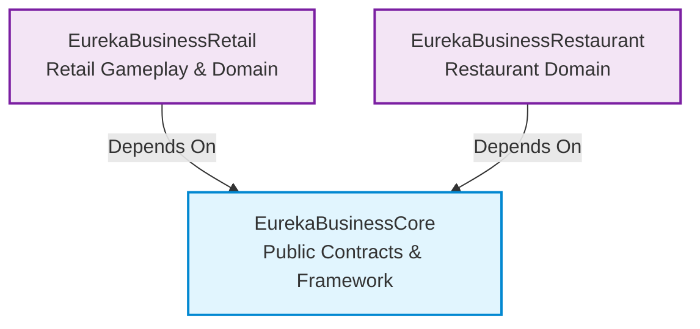

# Module Architecture & Design Contracts

This document explains the module boundaries, dependency hierarchy, and lifecycle contracts across EurekaBusiness submodules.

---

## Module Dependencies

Dependency directions are fixed: `Core <- Retail` and `Core <- Restaurant`. Retail and Restaurant never depend on each other.

---

## Core Module

Core provides stable public contracts, data models, registration lifecycles, permissions, persistence abstractions, and domain-neutral NPC, Worker, and Work Order extensions. Core has zero dependencies on Retail, Restaurant, client-only classes, or optional third-party mods.

---

## Retail Module

Retail handles shops, display pedestals, value catalogs, pricing, customer purchasing, retail work orders, transaction logs, and retail content registration. Retail consumes Core element and customer variant contracts without pushing retail-specific logic back into Core.

---

## Restaurant Module

Restaurant provides optional culinary gameplay, managing recipes, cooking stations, food orders, and restaurant worker tasks built upon Core contracts. Restaurant is an optional addon and never a dependency of Retail.

---

## Physical Side Boundaries

- `Common` source sets must never import client-only packages;
- The client manages rendering, user input, and HUD overlays; the server authoritatively controls shops, permissions, inventories, pricing, settlement, and persistence;
- Addons must ensure dedicated servers never load client classes;
- Every client packet must be re-validated on the server for target entity, reach distance, permissions, stock, and exact item stack data.

---

## Registration Lifecycles

Core and content modules expose explicit registration windows during mod initialization. Once the bootstrap window closes, registries freeze into immutable snapshots. Addons must register during this designated lifecycle and never mutate registries during gameplay ticks, screen openings, or transaction callbacks.
