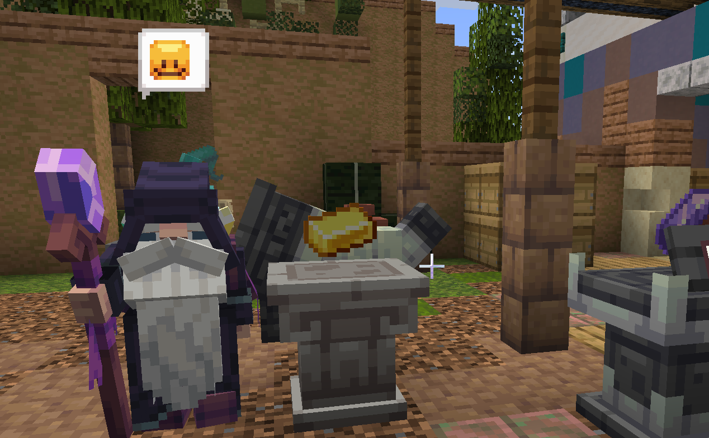
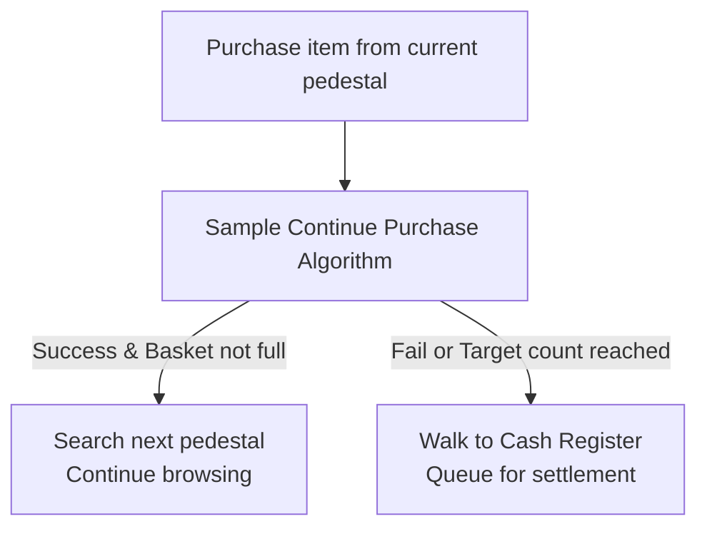
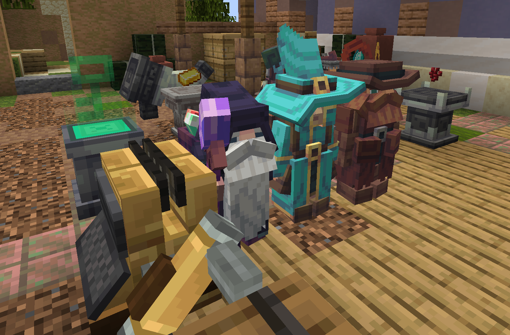

# Customer Behaviors, Variants & AI

This document introduces customer spawning rules, NPC occupational variants, preference mechanics, and continuous purchasing behavior.

---

## 1. Spawning & Store Entry

1. **Shop Status**: When a valid Shop Key rests inside the Key Device, the shop maintains the `OPEN` state.
2. **Entrances & Spawning**:
   - Customers spawn periodically near configured shop entrances.
   - Powered by a Behavior Tree, customers navigate across the sales floor evaluating accessible pedestals.
3. **Shopping Basket**:
   - Each customer carries a virtual shopping basket holding up to 5 distinct item kinds.

---

## 2. Customer Variants Reference

Customers belong to distinct occupational variants with unique models, textures, portraits, and elemental preferences:

| Variant ID | Name | Model & Portrait | Preferred Elements | Spawning & Rarity Conditions | Shopping & Continue Purchase |
| :--- | :--- | :--- | :--- | :--- | :--- |
| `customer.default` | **Adventurer** | Classic backpack model Portrait: `Gabriel` | General goods | 100% base rarity (fallback) | Base shopping (1-4 items, 50% willingness, 30% threshold) |
| `customer.mage` | **Mage** | Pointed hood & robe models Portraits: `Juan`, `Valdon`, `Violetta` | Magic `praecantatio` Aura `auram` Mind `cognitio` | **Shop Magic Profile** High spawn rate when $\sum \text{Magic} > 4$ | **Arcane Appetite** $+20\% + (\text{Lv} \times 3\%)$ when buying magic items |
| `customer.alchemist` | **Alchemist** | Potion robe model Portraits: `Isaac`, `Jasper`, `Maxine` | Magic `praecantatio` Energy `potentia` Poison `venenum` Taint `vitium` | **Potion & Toxin Profile** Scales with potion and brewing stock | **Alchemy Appetite** $+10\%$ for toxins/potions; boosted by greed items |
| `customer.explorer` | **Explorer** | Trail gear model Portraits: `Amelia`, `Conrad`, `Dylan` | Mining `perfodio` Travel `iter` Metal `metallum` Eldritch `alienis` | **Expedition Profile** Scales with tools, travel gear, compasses, maps | **Expedition Appetite** $+20\% + (\text{Lv} \times 2\%)$ for travel tools |
| `customer.miner` | **Miner** | Mining helmets & pack models Portraits: `Oscar`, `Sasha`, `Evelyn`, `Salvador` | Mining `perfodio` Metal `metallum` Earth `terra` | **Ore & Metal Profile** High spawn rate when $\sum \text{Minerals} > 5$ | **Mining Appetite** $+25\% + (\text{Lv} \times 3\%)$ for raw ores and metals |
| `customer.recolor_0` ~ `recolor_5` | **Traveler (6 Tints)** | 6 custom tinted outfits (Gold, Sky Blue, Emerald, Crimson, Violet, Cyan) | General goods | Fixed 12% rarity | Standard shopping (1-2 items, 50% willingness, 20% threshold) |

---

## 3. Shop Element Profiles & Rarity Sampling

- **Shop Element Profile**:
  - Upon customer spawn ticks, the server computes a snapshot of all active pedestal contents, recording distinct elements, maximum levels, and cumulative element sums ($\sum \text{Element}$).
  - Example: A shop exhibiting an Enchanted Book (`praecantatio` Lv.3), Ghast Tear (`praecantatio` Lv.2), and Blaze Rod (`potentia` Lv.2) yields `praecantatio_sum=5` and `potentia_sum=2`.
- **Dynamic Rarity Sampling**:
  - Variant selection algorithms evaluate the Shop Element Profile:
    - High magic levels and sums attract Mages and Alchemists;
    - High mining, earth, and metal sums draw Miners and Explorers.

---

## 4. Continuous Purchase Mechanism

Customers do not always leave immediately after purchasing an item.

- **Algorithm Mechanics**:
  - Following each successful purchase, the variant algorithm computes the continuous purchase chance based on item elements and shop atmosphere.
  - **Satisfaction Bonus**: Underpriced bargains or preferred elements substantially increase the chance to continue shopping.
  - **Basket Caps**: Hard limits ensure customers proceed to the cash register once their purchase target is satisfied.

---

## 5. Checkout and Leaving

After paying at the register, a customer walks out with everything it bought. Those items belong to the customer now. They are never taken back and never dropped on the way out.

A customer that leaves without paying (for example the shop closes first, or the register is removed) carries each basket line back to the pedestal it came from. When that pedestal cannot take the item, the customer looks for a return container inside the shop. Only when neither target is available do the items drop on the ground.

---

## 6. Customer Tips

After a successful checkout, customers leave a tip based on their variant:

- **Cash tip**: added on top of the amount credited to the value container. The register screen shows the full tip breakdown. The share and amount depend on the variant.
- **Item rewards**: some rare variants can leave an item behind. The mystic mage may leave an emerald, and deeper magic can even produce ancient debris.

Attach a Tip Label to a container to make it a valid drop off target. Before leaving, the customer walks to the nearest labeled container and places the reward inside. If the reward cannot be delivered before the customer leaves (for example the container was removed), it stays in the world in a recoverable way.

> Tip behavior is new in this version. The in world presentation is still being polished.
