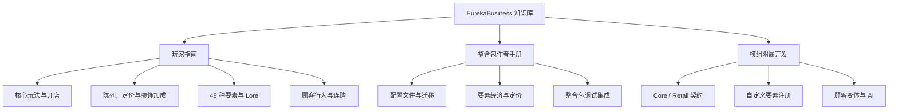

# 聪慧企业 (EurekaBusiness) 社区文档

欢迎来到 **EurekaBusiness** 官方社区文档。GitHub 仓库是唯一内容源，GitBook 用于发布与在线阅读。

EurekaBusiness 是面向 Minecraft 1.21.1 / NeoForge 的多人合作模拟经营模组。本维基为玩家、整合包作者以及模组附属开发者提供完整的使用指南、配置手册与 API 开发文档。

---

## 快速导航

### 1. 玩家指南
- [核心玩法与开店快速入门](players/Gameplay-Guide.md)
- [商品陈列、标价与店铺收益](players/Shop-Management.md)
- [店铺装饰品与加成指南](players/Decoration-Guide.md)
- [48 种要素属性与商品 Lore 系统](players/Elements-System.md)
- [顾客行为、变体与排队结算机制](players/Customer-Behaviors.md)

### 2. 整合包作者手册
- [配置文件与 Schema 迁移指南](pack-makers/Configuration-Guide.md)
- [商品目录与要素配置](pack-makers/Catalog-and-Economics.md)
- [整合包配置重置与开发调试](pack-makers/Pack-Integration.md)

### 3. 模组附属与开发者文档
- [模块架构与依赖边界](modules/Architecture-Contracts.md)
- [Core 模块与公共 API 概览](modules/Core-Module.md)
- [Retail 零售模块与扩展点](modules/Retail-Module.md)
- [Restaurant 餐饮模块边界](modules/Restaurant-Module.md)
- [附属 API 概览](addon-developers/Addon-API-Overview.md)
- [自定义要素与注册契约](addon-developers/Custom-Elements.md)
- [顾客变体、出现概率与连购算法开发](addon-developers/Customer-Variants-and-AI.md)

---

## 模组版本与兼容基线

| 属性 | 规格 / 基线 |
| --- | --- |
| **游戏版本** | Minecraft Java Edition `1.21.1` |
| **模组加载器** | NeoForge `21.1.x` (推荐 `21.1.238`+) |
| **Java 版本** | Java 21 |
| **外部必需依赖** | `Fzzy Config` (`0.7.6+1.21+neoforge`), `Kotlin for Forge` (`5.4.0`) |
| **Wiki 受众** | 玩家,整合包作者,模组附属作者 |
| **网络架构** | 服务端权威 (Server-Authoritative)；客户端仅负责交互与渲染呈现 |
