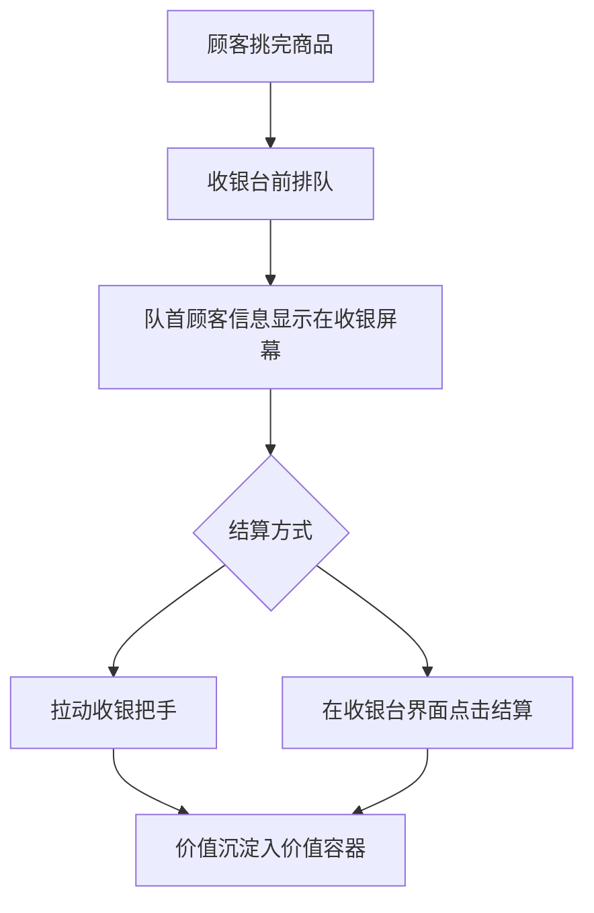

# 收银台与结算设备

本节介绍用于店铺人工结算、队首顾客交互以及收益沉淀的核心方块。

---

## 收银台 (Cash Register)

* **方块注册名**：`eurekabusinesscore:cash_register`
* **方块实体**：`CashRegisterBlockEntity`
* **功能简述**：店铺的物理结算中枢。顾客挑完商品后会在此排队等待结账，内部可装载价值容器接收收益。

### 结构与界面

1. **队首显示屏**：收银台朝向排队玩家的一面配有屏幕，实时渲染当前队首顾客的 **42×42 肖像**、顾客名称与当前应付总价值。
2. **容器槽位**：右键收银台可打开管理界面，支持放入 **价值容器 (Value Container)**。没有放入有效价值容器的店铺无法营业。
3. **单列排队机制**：多位顾客会依次在收银台前方保持队列等候，队列具有活跃度检测（Queue Liveness），超时不结算将自动解散。

---

## 收银台把手 (Cashier Handle)

* **方块注册名**：`eurekabusinesscore:cashier_handle`
* **方块实体**：`CashRegisterHandleBlockEntity`
* **功能简述**：放置在收银台侧面的物理拉动把手，为人工结账提供沉浸式实体交互。

### 安装与使用

* **安装要求**：必须放置在收银台右侧相邻方块，且朝向与收银台保持一致。
* **物理拉动结算**：右键拉动把手时，把手将执行下压回弹物理动画并伴随清脆机械声响，服务端将立即为队首顾客完成单笔原子结算。
* **交易反馈**：
  * 商品款项一次性入账至收银台内的价值容器；
  * 顾客头顶冒出完成交易反馈并转身离开店铺；
  * 交易细节记录至店铺经营历史中。

> [!TIP]
> 无论是通过拉动收银台把手还是在收银台界面中点击结算按钮，后台均通过同一条服务端原子交易事务结算，确保物品扣减与收益入账的一致性。
