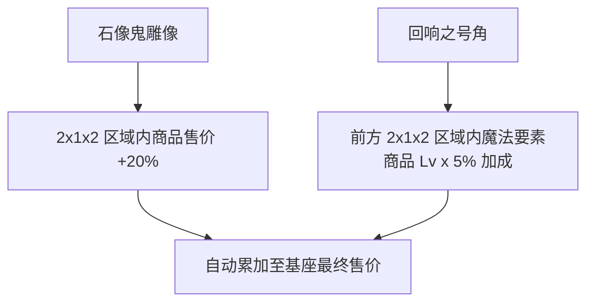

# 店铺装饰品

本节介绍用于美化店铺并在空间内提供陈列加成效果的特色装饰品方块。

---

## 装饰品概览

在店铺区域内摆放装饰品方块，能自动辐射覆盖范围内的陈列基座，提升售价与收益：

---

## 石像鬼雕像 (Gecho Gargoyle)

* **方块注册名**：`eurekabusinessretail:gecho_gargoyle`
* **物品注册名**：`eurekabusinessretail:gecho_gargoyle`
* **加成机制**：以自身为中心的 $2 \times 1 \times 2$ 空间范围内，所有陈列基座上的商品基础售价 **+20%**。


将石像鬼雕像摆放在店铺货架中央，可以最大化辐射多个常规商品陈列区。


---

## 回响之号角 (Resounding Horn)

* **方块注册名**：`eurekabusinessretail:resounding_horn`
* **物品注册名**：`eurekabusinessretail:resounding_horn`
* **加成机制**：朝向正前方 $2 \times 1 \times 2$ 空间范围内，所有带有 **魔法要素 (`praecantatio`)** 的商品，每拥有 1 级魔法要素，最终售价额外 **+5%**。


将回响之号角正对高阶附魔书、恶魂之泪或法杖陈列柜，可形成极高倍率的魔法专柜加成。


---

## 叠加计算规则

* **多装饰叠加**：当同一个基座同时处于石像鬼雕像与回响之号角范围内时，加成比例线性相加。
* **持久化保障**：装饰品数据随店铺空间自动保存，世界重载后无需重新摆放即可生效。
