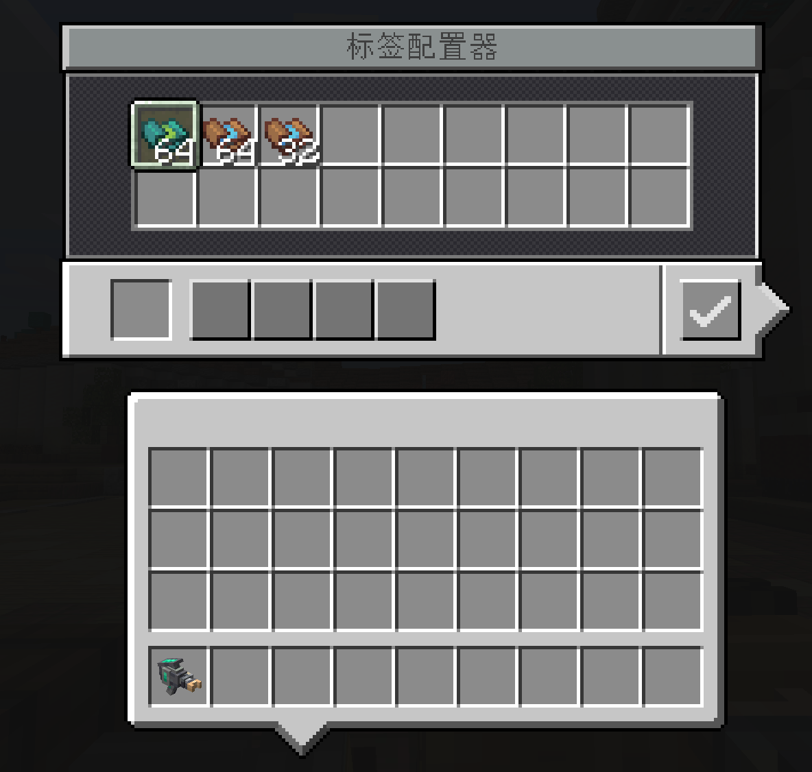
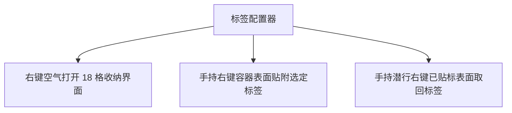
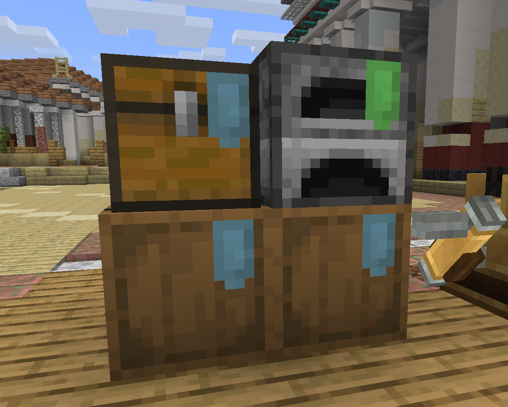

# 容器标签与标签配置器

本节介绍用于在各类容器表面贴附功能标签、指示退货与小费箱的标签体系。

---

## 标签配置器 (Label Configurator)

* **物品注册名**：`eurekabusinesscore:label_configurator`
* **堆叠上限**：1
* **功能简述**：用于管理、贴附与取下容器标签的多功能工具。内置 18 格标签收纳空间。

### 交互操作

1. **内置收纳仓**：右键空气打开 18 格专属收纳背包，可随身存放各类空白标牌与功能标签。
2. **快捷贴附**：手持配置器瞄准容器表面（如箱子、木桶等）右键，可将选中的标签贴附在对应方块表面。
3. **安全回收**：手持配置器潜行右键已贴附标签的表面，即可将标签无损取回至收纳仓中。

---

## 空白标牌 (Blank Label)

* **物品注册名**：`eurekabusinesscore:blank_label`
* **堆叠上限**：64
* **功能简述**：基础标牌物品，用于在容器表面做标记或作为功能标签的合成基础。

---

## 退货标签 (Return Label)

* **物品注册名**：`eurekabusinessretail:return_label`
* **堆叠上限**：64
* **功能简述**：将容器标记为 **未付款商品退货箱**。

### 行为逻辑

当顾客在店内因打烊、未带足够预算或中途放弃购物而离开时，若手头持有未结算的店内商品：
- 顾客在走向出口前会自动寻找带有 **退货标签** 的有效容器；
- 将未付款商品完整放回该退货箱中；
- 避免商品直接掉落或遗失，保障店铺库存安全。

---

## 小费标签 (Tip Label)

* **物品注册名**：`eurekabusinessretail:tip_label`
* **堆叠上限**：64
* **功能简述**：将容器标记为 **顾客小费箱**。高满意度或触发连购的顾客在离开时有一定概率在此留下额外报酬。

> [!TIP]
> 标签可以贴附在原版箱子、木桶以及绝大多数支持物品存储的模组容器表面。
