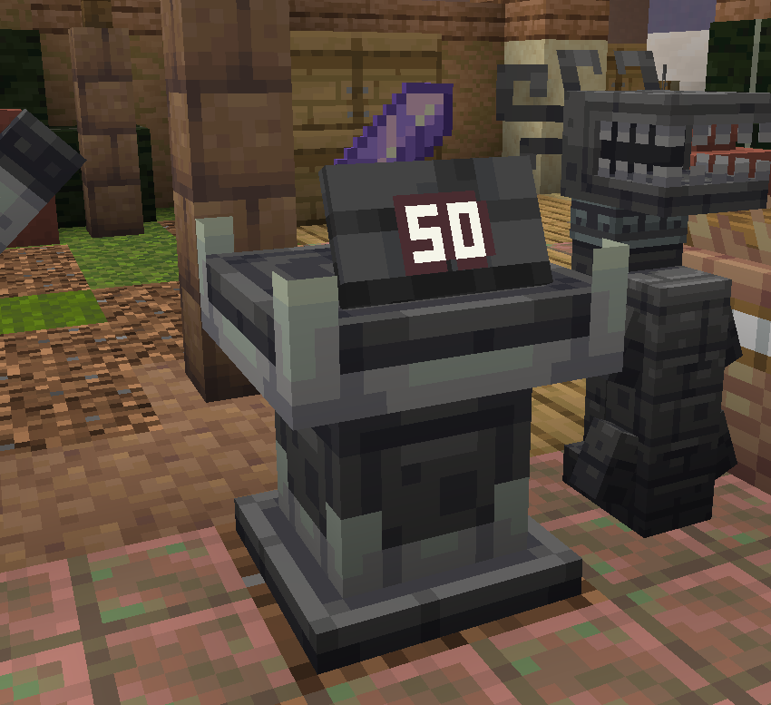
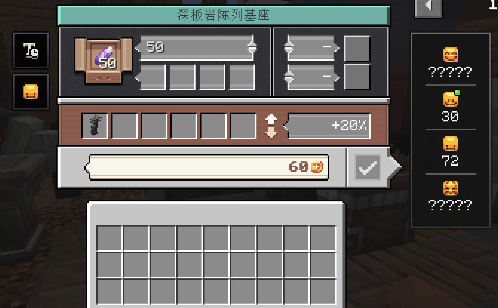
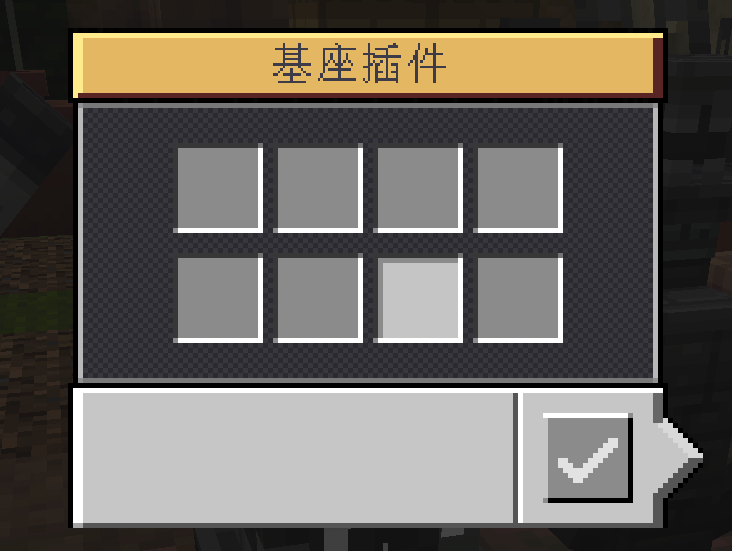

# 陈列基座与价格牌

本节介绍用于展示商品、标价与安装功能模块的陈列基座体系。

---

## 陈列基座 (Display Pedestals)



* **方块注册名**：
  * `eurekabusinessretail:nomad_pedestal` (游牧木质基座)
  * `eurekabusinessretail:deepslate_pedestal` (深板岩基座)
  * `eurekabusinessretail:stone_pedestal` (石质基座)
* **方块实体**：`DisplayPedestalBlockEntity`
* **功能简述**：店铺售卖商品的核心展示方块，可容纳一组物品并提供 8 个插件槽位。

### 特性与容量

* **最大堆叠**：基座最大容量遵循放入物品自身的最大堆叠上限（如末影珍珠为 16，矿石为 64）。
* **商品全息渲染**：商品悬浮在基座上方缓慢旋转并呈现清晰的世界空间视觉效果。
* **侧面插件面板**：基座的四个侧面拥有独立的交互面。右键侧面中央面板可打开 **基座插件配置界面 (8 插件槽)**。





---

## 价格牌模块 (Price Tag)

* **物品注册名**：`eurekabusinessretail:upgrade/price_tag`
* **堆叠上限**：1
* **功能简述**：安装在基座插件槽内，用于向顾客公开该基座商品的售价。

### 调价与顾客心理

```mermaid
flowchart TD
    Tag[安装价格牌] --> Price[设置商品价格]
    Price --> React{顾客心理评估}
    React --> C1[廉价 (Cheap) -> 秒买并刺激连购]
    React --> C2[完美 (Perfect) -> 标准预期成交]
    React --> C3[昂贵 (Expensive) -> 部分高预算顾客成交]
    React --> C4[天价 (Overpriced) -> 拒绝购买并离开]
```

1. **公开标价展示**：价格牌安装后将在基座上方以 22.5° 倾角悬挂显示标价，支持紧凑的 `K/M/B` 大额数字显示。
2. **快速调价操作**：
   - 在基座售卖界面中输入数字或滑动调节；
   - 通过价格牌的数值交互框直接快速调整价格。
3. **同款低价优先机制**：
   - 若店内有多个基座出售完全相同的商品但标价不同，顾客一定会优先前往标价最低的基座进行选购。

---

## 升级模版 (Upgrade Template)

* **物品注册名**：`eurekabusinessretail:upgrade_template`
* **堆叠上限**：1
* **功能简述**：用于在锻造台或工作台中制作价格牌等基座功能插件的通用升级基底。

---

## 商品价值与要素配置 (Value Catalog Configuration)

商品目录与参考价值由 Fzzy Config 配置文件 `config/eurekabusinessretail.toml` (`eurekabusinessretail:value_catalog`) 驱动，可以通过修改此配置文件自定义商品价格区间与要素属性：

```toml
[[catalogEntries]]
itemId = "minecraft:diamond"
cheap = { start = 35, end = 80, stamp = 55 }
perfect = { start = 81, end = 220, stamp = 150 }
expensive = { start = 221, end = 400, stamp = 310 }
overpriced = { start = 401, end = 650, stamp = 525 }

[[catalogEntries.elements]]
elementId = "eurekabusinesscore:element_vitreus"
level = 3
```


可通过修改此配置文件为任意原版或其它模组物品配置四档区间和对应要素属性，客户端将自动同步服务端的最新商品目录。

