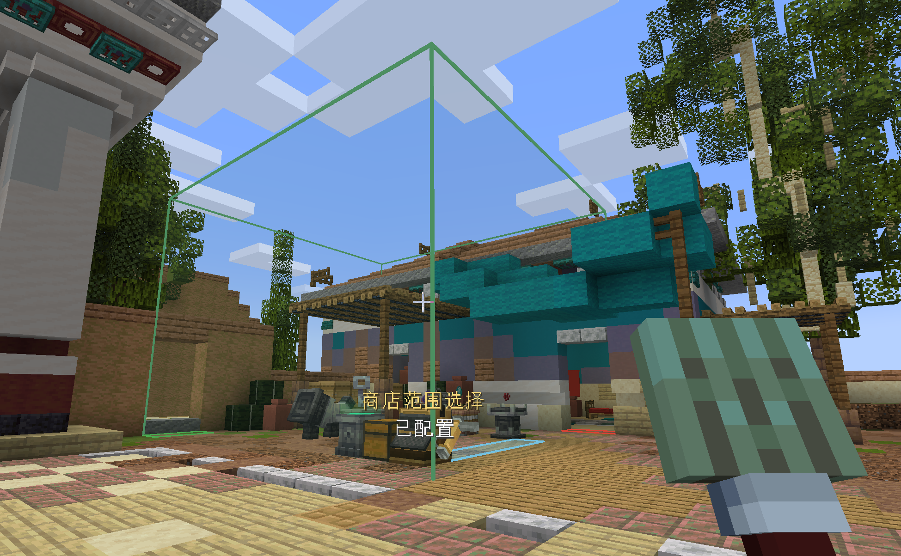
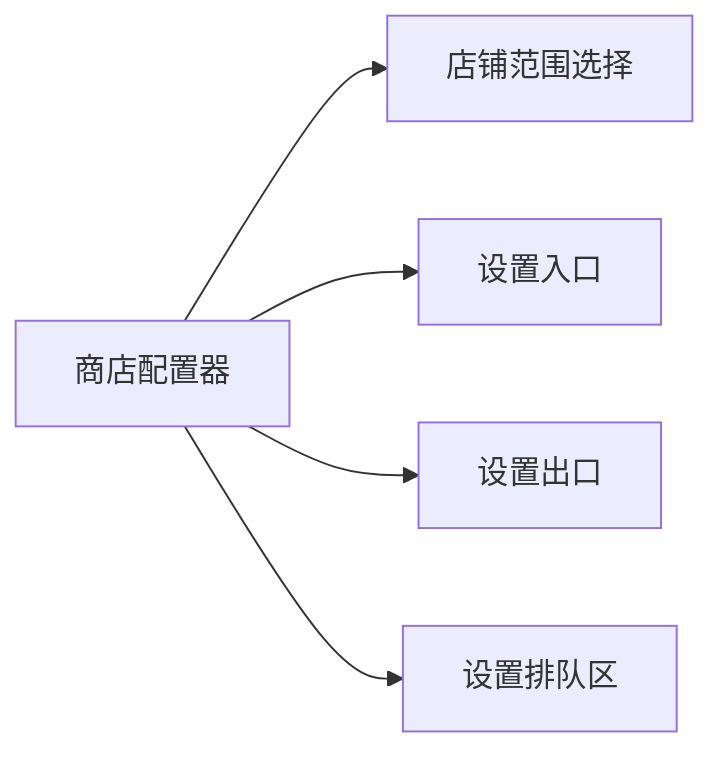
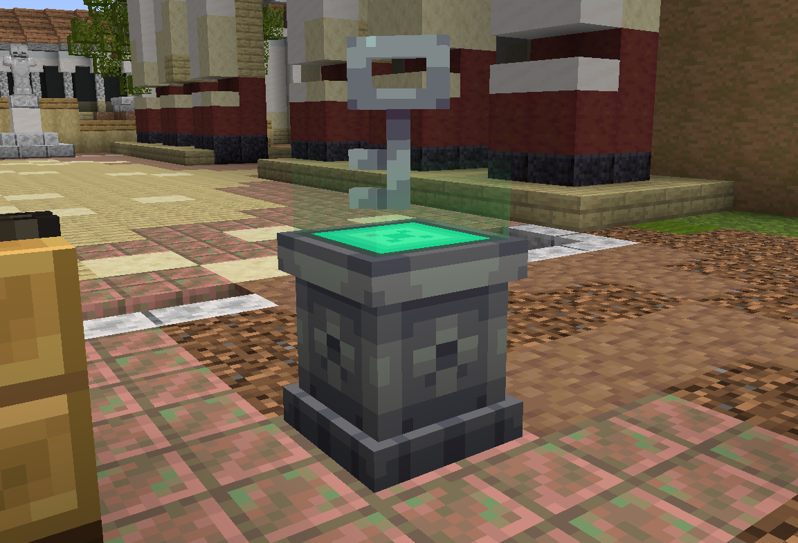

# 店铺空间与营业管理

本节介绍用于店铺空间划分、所有权绑定以及营业开关控制的核心方块与物品。

---

## 商店配置器 (Shop Configurator)

* **物品注册名**：`eurekabusinesscore:shop_configurator`
* **堆叠上限**：1
* **功能简述**：用于圈定店铺空间 AABB 范围、设置顾客出入口与排队区。

### 使用方式

1. **模式切换**：按住交互键或右键空气打开模式选择轮盘，可切换不同工作模式。手持配置器头部颜色会随当前模式实时变化。
2. **圈定店铺范围**：
   - 切换至 `店铺范围选择` 模式。
   - 潜行右键点击第一个方块作为起点，再右键点击对角方块作为终点，系统将生成立体店铺包围盒 (AABB)。
3. **设置出入口与排队区**：
   - 切换至 `设置入口` / `设置出口` 模式，右键地面方块标记顾客生成与离店位置。
   - 切换至 `设置排队区` 模式，右键收银台前方地面标记排队等候区域。

> [!CAUTION]
> 店铺在营业期间（插入了有效钥匙）或店内仍有未离开的顾客时，配置器会锁定编辑功能。如需重新划分空间，请先从钥匙设备中取回钥匙打烊。

> [!TIP]
> 商店支持设置多个出入口。顾客在进出店铺时会根据当前拥堵情况与路径距离智能选择最优出入口。

---

## 店铺钥匙设备 (Key Device)

* **方块注册名**：`eurekabusinesscore:key_device`
* **方块实体**：`KeyDeviceBlockEntity`
* **功能简述**：店铺唯一的实体营业开关，展示店铺当前营业状态与全息边界。

### 方块特性

* **光柱与状态指示**：
  - **无钥匙**：设备呈静止熄灭状态（光级 5）。
  - **已插入钥匙但未营业**：外层光柱亮起（光级 10），顶盖指示灯点亮。
  - **正在营业 (OPEN)**：双层同轴光柱完全点亮（光级 15），设备上方投影绿色全息旋转钥匙。
* **物理防漏斗设计**：钥匙设备不开放外部物品管道交互，无法被漏斗抽取钥匙，确保关店操作必须由玩家实体进行。

---

## 商店钥匙 (Shop Key)

* **物品注册名**：`eurekabusinesscore:shop_key`
* **堆叠上限**：1
* **功能简述**：记录店铺唯一标识、所有者信息与绑定的钥匙设备世界坐标。

### 交互与所有权

* **初次绑定**：手持未绑定的商店钥匙，在自己的店铺区域内潜行右键已放置的钥匙设备，钥匙将写入该店铺的所有权信息与设备坐标。
* **插取与营业**：
  * **插入钥匙**：手持已绑定的钥匙右键设备。
  * **切换营业**：空手潜行右键装有钥匙的设备，在营业与暂停营业间切换。
  * **取回钥匙**：空手普通右键设备，取回钥匙并立即强制打烊。
* **解除绑定**：将已绑定的商店钥匙单独放入合成栏即可清除所有权数据，还原为未绑定的空白钥匙。

> [!NOTE]
> 钥匙仅持有绑定凭证快照，所有权限与营业状态校验均由服务端在交互时重新计算，确保多人联机环境下的安全性。
