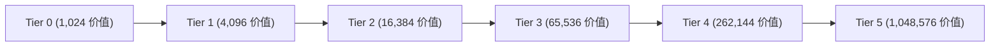

# 价值容器与收益存储

本节介绍用于在收银台接收顾客货款、安全存储交易价值并支持多阶升级的核心容器。

---

## 价值容器 (Value Container)

* **方块/物品注册名**：`eurekabusinesscore:value_container`
* **方块实体**：`ValueContainerBlockEntity`
* **功能简述**：店铺营业必需的收益沉淀容器，支持随身携带、放置为方块以及在收银台中装载。

---

## 5 阶容量升级阶梯

价值容器拥有 5 次升级阶梯，每次升级后容量变为原来的 **4 倍**：

| 阶级 (Tier) | 容量上限 (Max Value) | 升级配方规则 | 放置态光源等级 |
| :---: | :---: | :--- | :---: |
| **Tier 0** | `1,024` 价值 | 默认合成 | 0 ~ 1 |
| **Tier 1** | `4,096` 价值 | 存满 1,024 后将自身放入工作台升级 | 1 ~ 2 |
| **Tier 2** | `16,384` 价值 | 存满 4,096 后将自身放入工作台升级 | 2 ~ 4 |
| **Tier 3** | `65,536` 价值 | 存满 16,384 后将自身放入工作台升级 | 4 ~ 5 |
| **Tier 4** | `262,144` 价值 | 存满 65,536 后将自身放入工作台升级 | 5 ~ 7 |
| **Tier 5** | `1,048,576` 价值 | 存满 262,144 后将自身放入工作台升级 | 8（满阶最高） |

### 升级配方细节

1. **满容触发**：只有当容器内的当前余额达到该阶级最大容量时，放入工作台（单物品自合成）才会产出下一阶级的容器。
2. **余额归零**：升级合成产出的新容器余额为零，容量扩充为 4 倍。已存入的价值作为升级成本消耗。
3. **附魔光效提示**：已存满可升级的容器物品在物品栏中会附带附魔光效，提醒玩家可以进行升级。


放置在世界中的价值容器会根据当前存储的价值占容量比例动态发出光亮（光级 0 ~ 8）。破坏方块时完整保留容器阶级与内部余额数据。

