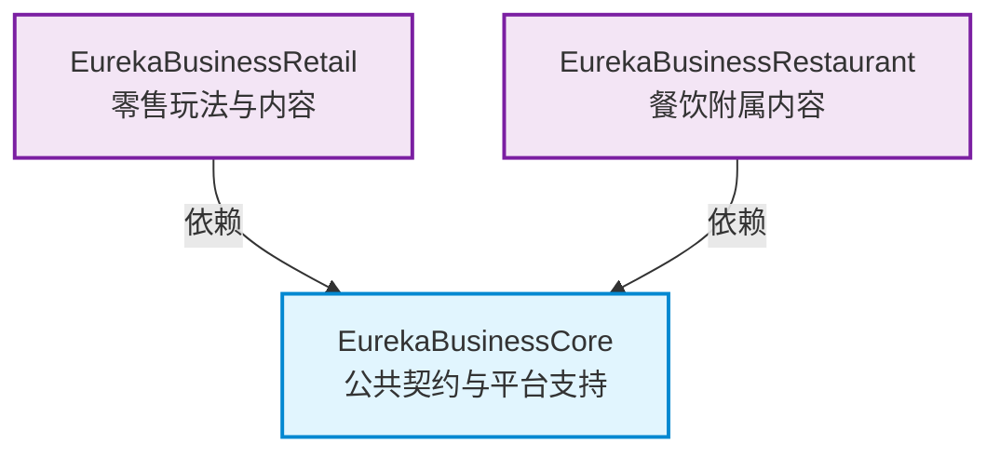

# 模块架构与设计契约 (Architecture Contracts)

本文档面向附属模组作者，也适合需要排查整合包依赖的维护者。

---

## 模块依赖关系

依赖方向固定为 `Core <- Retail` 与 `Core <- Restaurant`。Retail 与 Restaurant 互不依赖。

---

## Core

Core 提供稳定的公共契约、数据模型、注册生命周期、权限与持久化边界，以及通用 NPC、Worker 和 Work Order 扩展契约。Core 不依赖 Retail、Restaurant、客户端类或可选第三方模组。

---

## Retail

Retail 负责店铺、陈列基座、商品目录、定价、顾客购买、零售工作订单、交易记录和零售内容注册。Retail 可以消费 Core 的元素和顾客变体契约，但不能把零售规则写回 Core。

---

## Restaurant

Restaurant 是可选的餐饮内容模块，负责菜单、餐饮方块、餐饮订单和基于 Core 契约的餐厅任务扩展。Restaurant 不是 Retail 的依赖。

---

## 侧隔离

- `Common` 代码不能引用客户端专属类。
- 客户端负责呈现和输入，服务端负责店铺、权限、库存、价格、结算和持久化。
- 附属模组的服务端入口不得加载客户端渲染、Screen 或 HUD 类。
- 任何客户端请求都必须在服务端重新校验目标、距离、权限、库存、价格和完整物品数据。

---

## 注册生命周期

Core 与内容模块的公共扩展使用启动期注册器。注册窗口关闭后，注册表变成只读快照。附属模组应在注册生命周期提供的窗口内注册，不要在实体 tick、Screen 打开或交易回调中改变注册表。
